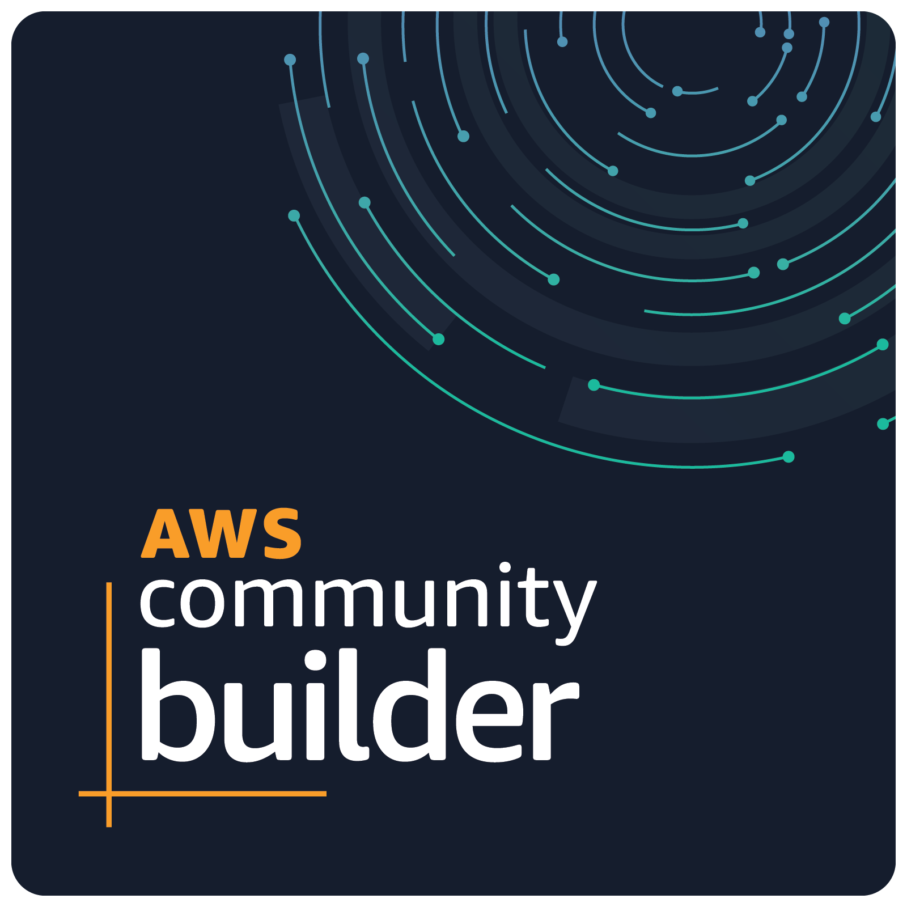

### :octocat: [kyhau.github.io](https://kyhau.github.io) | [gist](https://gist.github.com/kyhau)
- 🔭 [aws-tools](https://github.com/kyhau/aws-tools) 
    | [workspace](https://github.com/kyhau/workspace) 
  | [vscode-configs](https://github.com/kyhau/vscode-configs) 
  | [.github](https://github.com/kyhau/.github) 
  | [snyk](https://app.snyk.io)
  | [hacktoberfest](https://hacktoberfest.com/)
  | [+repos](projects.md/#aws-related-projects) 
  | [+notes](projects.md/#blogs-and-notes)
- 🔗 [tryhackme](https://tryhackme.com/)
  | [hackerrank](https://www.hackerrank.com/)
  | [cryptohack](https://cryptohack.org/)
  | [skillbuilder](https://explore.skillbuilder.aws/)
  | [cncf](https://landscape.cncf.io)
  | [nextstrain](https://nextstrain.org/ncov/gisaid/global/6m)
  | [privacytools](https://www.privacytools.io/)
  | [+links](https://github.com/kyhau/workspace/blob/main/quick-notes/UsefulLinks.md)

 

<!--
**kyhau/kyhau** is a ✨ _special_ ✨ repository because its `README.md` (this file) appears on your GitHub profile.

Here are some ideas to get you started:

- 🔭 I’m currently working on ...
- 🌱 I’m currently learning ...
- 👯 I’m looking to collaborate on ...
- 🤔 I’m looking for help with ...
- 💬 Ask me about ...
- 📫 How to reach me: ...
- 😄 Pronouns: ...
- ⚡ Fun fact: ...
-->
